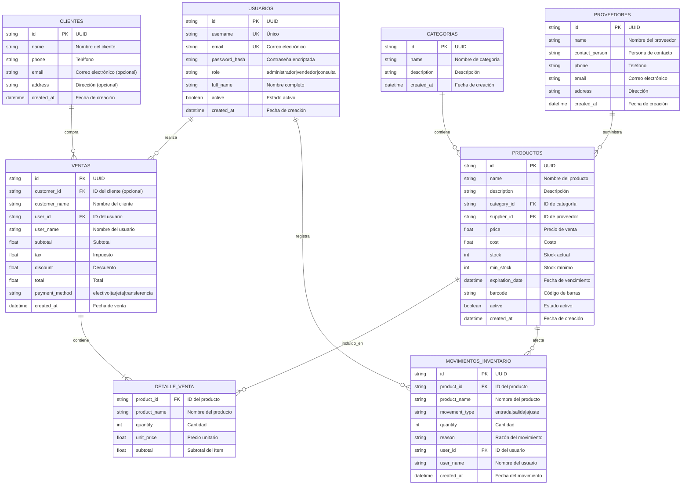

# 📊 Modelo de Datos - Sistema de Farmacia Maribel

## Diagrama Entidad-Relación (ERD)

Este documento describe la estructura de la base de datos del Sistema de Control de Inventario y Facturación para Farmacia Maribel.

---

## 🗂️ Diagrama Visual (Mermaid)



---

## 📋 Descripción Detallada de Tablas

### 1. 👤 USUARIOS (users)

| Campo | Tipo | Restricción | Descripción |
|-------|------|-------------|-------------|
| `id` | string (UUID) | PRIMARY KEY | Identificador único |
| `username` | string | UNIQUE, NOT NULL | Nombre de usuario para login |
| `email` | string | UNIQUE, NOT NULL | Correo electrónico |
| `password_hash` | string | NOT NULL | Contraseña encriptada con bcrypt |
| `role` | string | NOT NULL | Rol: `administrador`, `vendedor`, `consulta` |
| `full_name` | string | NOT NULL | Nombre completo del usuario |
| `active` | boolean | DEFAULT TRUE | Estado activo/inactivo |
| `created_at` | datetime | DEFAULT NOW | Fecha y hora de creación |

**Roles disponibles:**
- `administrador`: Acceso total (CRUD completo, eliminar)
- `vendedor`: Puede vender y ver reportes
- `consulta`: Solo lectura

---

### 2. 📁 CATEGORIAS (categories)

| Campo | Tipo | Restricción | Descripción |
|-------|------|-------------|-------------|
| `id` | string (UUID) | PRIMARY KEY | Identificador único |
| `name` | string | NOT NULL | Nombre de la categoría |
| `description` | string | NOT NULL | Descripción de la categoría |
| `created_at` | datetime | DEFAULT NOW | Fecha de creación |

**Ejemplos de categorías:**
- Medicamentos
- Productos de Higiene
- Vitaminas
- Cosméticos
- Equipo Médico

---

### 3. 🏭 PROVEEDORES (suppliers)

| Campo | Tipo | Restricción | Descripción |
|-------|------|-------------|-------------|
| `id` | string (UUID) | PRIMARY KEY | Identificador único |
| `name` | string | NOT NULL | Nombre del proveedor |
| `contact_person` | string | NOT NULL | Persona de contacto |
| `phone` | string | NOT NULL | Número de teléfono |
| `email` | string | NOT NULL | Correo electrónico |
| `address` | string | NOT NULL | Dirección física |
| `created_at` | datetime | DEFAULT NOW | Fecha de registro |

---

### 4. 💊 PRODUCTOS (products)

| Campo | Tipo | Restricción | Descripción |
|-------|------|-------------|-------------|
| `id` | string (UUID) | PRIMARY KEY | Identificador único |
| `name` | string | NOT NULL | Nombre del producto |
| `description` | string | NOT NULL | Descripción detallada |
| `category_id` | string | FOREIGN KEY → CATEGORIAS | Categoría del producto |
| `supplier_id` | string | FOREIGN KEY → PROVEEDORES | Proveedor del producto |
| `price` | float | NOT NULL | Precio de venta al público |
| `cost` | float | NOT NULL | Costo de adquisición |
| `stock` | int | NOT NULL | Cantidad en inventario |
| `min_stock` | int | DEFAULT 10 | Stock mínimo (alerta) |
| `expiration_date` | datetime | NULLABLE | Fecha de vencimiento |
| `barcode` | string | NULLABLE | Código de barras |
| `active` | boolean | DEFAULT TRUE | Producto activo |
| `created_at` | datetime | DEFAULT NOW | Fecha de registro |

**Cálculos automáticos:**
- Ganancia = `price - cost`
- Alerta de stock bajo: cuando `stock < min_stock`
- Alerta de vencimiento: productos próximos a vencer

---

### 5. 👥 CLIENTES (customers)

| Campo | Tipo | Restricción | Descripción |
|-------|------|-------------|-------------|
| `id` | string (UUID) | PRIMARY KEY | Identificador único |
| `name` | string | NOT NULL | Nombre completo |
| `phone` | string | NOT NULL | Número de teléfono |
| `email` | string | NULLABLE | Correo electrónico (opcional) |
| `address` | string | NULLABLE | Dirección (opcional) |
| `created_at` | datetime | DEFAULT NOW | Fecha de registro |

---

### 6. 🧾 VENTAS (sales)

| Campo | Tipo | Restricción | Descripción |
|-------|------|-------------|-------------|
| `id` | string (UUID) | PRIMARY KEY | Identificador único de venta |
| `customer_id` | string | FOREIGN KEY → CLIENTES | Cliente (opcional) |
| `customer_name` | string | NOT NULL | Nombre del cliente |
| `user_id` | string | FOREIGN KEY → USUARIOS | Vendedor que realizó la venta |
| `user_name` | string | NOT NULL | Nombre del vendedor |
| `subtotal` | float | NOT NULL | Subtotal antes de impuestos |
| `tax` | float | DEFAULT 0 | Impuesto aplicado |
| `discount` | float | DEFAULT 0 | Descuento aplicado |
| `total` | float | NOT NULL | Total a pagar |
| `payment_method` | string | NOT NULL | Método: `efectivo`, `tarjeta`, `transferencia` |
| `created_at` | datetime | DEFAULT NOW | Fecha y hora de la venta |

**Nota:** El campo `details` contiene un array de `DETALLE_VENTA` embebido.

---

### 7. 📦 DETALLE_VENTA (sale_details) - Embebido en VENTAS

| Campo | Tipo | Restricción | Descripción |
|-------|------|-------------|-------------|
| `product_id` | string | FOREIGN KEY → PRODUCTOS | Producto vendido |
| `product_name` | string | NOT NULL | Nombre del producto |
| `quantity` | int | NOT NULL | Cantidad vendida |
| `unit_price` | float | NOT NULL | Precio unitario |
| `subtotal` | float | NOT NULL | quantity × unit_price |

---

### 8. 📊 MOVIMIENTOS_INVENTARIO (inventory_movements)

| Campo | Tipo | Restricción | Descripción |
|-------|------|-------------|-------------|
| `id` | string (UUID) | PRIMARY KEY | Identificador único |
| `product_id` | string | FOREIGN KEY → PRODUCTOS | Producto afectado |
| `product_name` | string | NOT NULL | Nombre del producto |
| `movement_type` | string | NOT NULL | Tipo: `entrada`, `salida`, `ajuste` |
| `quantity` | int | NOT NULL | Cantidad del movimiento |
| `reason` | string | NOT NULL | Motivo del movimiento |
| `user_id` | string | FOREIGN KEY → USUARIOS | Usuario que registró |
| `user_name` | string | NOT NULL | Nombre del usuario |
| `created_at` | datetime | DEFAULT NOW | Fecha del movimiento |

**Tipos de movimiento:**
- `entrada`: Compra de producto, recepción de mercancía
- `salida`: Venta, pérdida, devolución a proveedor
- `ajuste`: Corrección de inventario físico

---

## 🔗 Relaciones entre Tablas

```
┌─────────────┐     ┌─────────────┐     ┌─────────────┐
│  USUARIOS   │     │  CATEGORIAS │     │ PROVEEDORES │
│   (users)   │     │(categories) │     │ (suppliers) │
└──────┬──────┘     └──────┬──────┘     └──────┬──────┘
       │                   │                   │
       │ 1:N               │ 1:N               │ 1:N
       ▼                   ▼                   ▼
┌──────────────────────────────────────────────────────┐
│                     PRODUCTOS                        │
│                     (products)                       │
└──────────────────────────┬───────────────────────────┘
                           │
          ┌────────────────┼────────────────┐
          │ 1:N            │ 1:N            │
          ▼                ▼                ▼
┌─────────────────┐ ┌─────────────┐ ┌──────────────────┐
│ DETALLE_VENTA   │ │ MOV_INVENT. │ │    CLIENTES      │
│ (sale_details)  │ │             │ │   (customers)    │
└────────┬────────┘ └─────────────┘ └────────┬─────────┘
         │                                   │
         │ N:1                               │ 1:N
         ▼                                   ▼
┌───────────────────────────────────────────────────────┐
│                       VENTAS                          │
│                       (sales)                         │
└───────────────────────────────────────────────────────┘
         ▲
         │ N:1
┌────────┴────────┐
│    USUARIOS     │
│    (vendedor)   │
└─────────────────┘
```

---

## 📐 Reglas de Negocio

### Control de Stock
1. Al crear una venta → Se reduce el `stock` del producto automáticamente
2. Al registrar entrada de inventario → Se incrementa el `stock`
3. Al registrar salida de inventario → Se reduce el `stock`
4. Alerta cuando `stock < min_stock`

### Permisos por Rol
| Acción | Administrador | Vendedor | Consulta |
|--------|:-------------:|:--------:|:--------:|
| Ver datos | ✅ | ✅ | ✅ |
| Crear | ✅ | ✅ | ❌ |
| Editar | ✅ | ✅ | ❌ |
| Eliminar | ✅ | ❌ | ❌ |
| Gestionar usuarios | ✅ | ❌ | ❌ |
| Backup/Restore | ✅ | ❌ | ❌ |

### Integridad Referencial
- No se puede eliminar una categoría con productos asociados
- No se puede eliminar un proveedor con productos asociados
- No se puede eliminar un producto con ventas asociadas
- No se puede eliminar un usuario administrador si es el único

---

## 🛠️ Índices Recomendados

```javascript
// MongoDB Indexes
db.users.createIndex({ "username": 1 }, { unique: true })
db.users.createIndex({ "email": 1 }, { unique: true })
db.products.createIndex({ "category_id": 1 })
db.products.createIndex({ "supplier_id": 1 })
db.products.createIndex({ "barcode": 1 })
db.products.createIndex({ "expiration_date": 1 })
db.sales.createIndex({ "customer_id": 1 })
db.sales.createIndex({ "user_id": 1 })
db.sales.createIndex({ "created_at": -1 })
db.inventory_movements.createIndex({ "product_id": 1 })
db.inventory_movements.createIndex({ "created_at": -1 })
```

---

## 📊 Colecciones MongoDB

| Colección | Descripción |
|-----------|-------------|
| `users` | Usuarios del sistema |
| `categories` | Categorías de productos |
| `suppliers` | Proveedores |
| `products` | Catálogo de productos |
| `customers` | Clientes registrados |
| `sales` | Historial de ventas |
| `inventory_movements` | Movimientos de inventario |

---

## 🎨 Código de Colores para Diagrama Visual

Si deseas crear un diagrama visual usando herramientas como:
- [dbdiagram.io](https://dbdiagram.io)
- [Lucidchart](https://lucidchart.com)
- [draw.io](https://draw.io)

**Colores sugeridos:**
- 🔵 **Azul**: Tablas principales (USUARIOS, PRODUCTOS, VENTAS)
- 🟢 **Verde**: Catálogos (CATEGORIAS, PROVEEDORES)
- 🟡 **Amarillo**: Transaccionales (DETALLE_VENTA, MOVIMIENTOS)
- 🟠 **Naranja**: Clientes

---

## 📝 Notas Técnicas

- **Base de datos**: MongoDB (NoSQL)
- **IDs**: UUID v4 generados automáticamente
- **Fechas**: UTC timestamp
- **Contraseñas**: Hash bcrypt
- **Autenticación**: JWT Token (24 horas de expiración)
- **Moneda**: Córdobas (C$)

---

*Documento generado para el Sistema de Farmacia Maribel*
*Versión: 1.0 | Fecha: Diciembre 2025*
